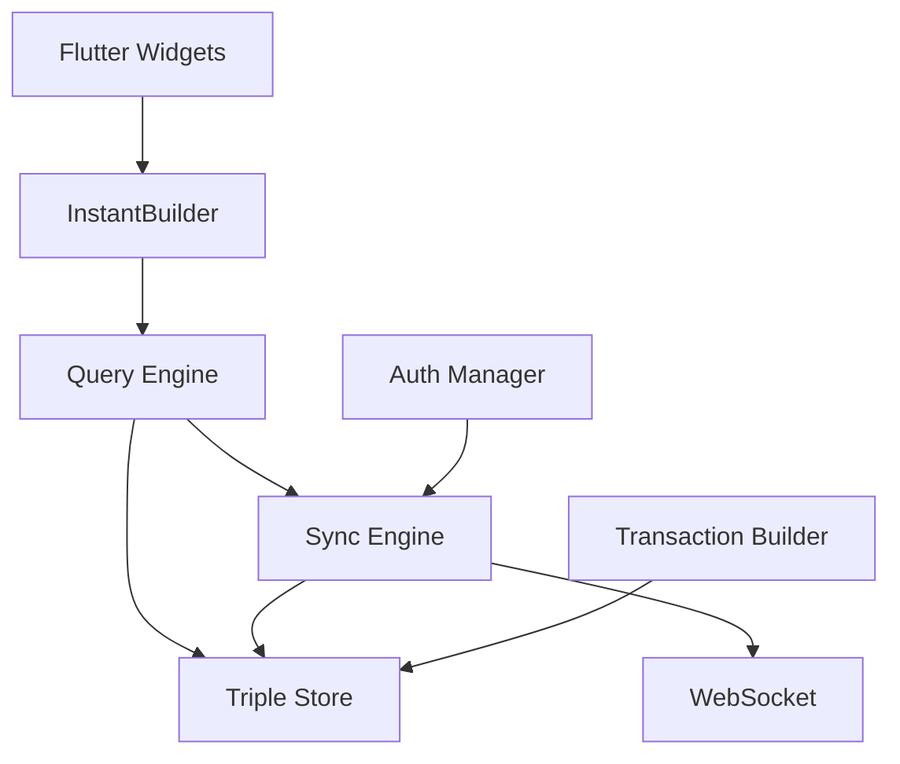

# Flutter InstantDB - Development Guide

This guide covers building, testing, debugging, and maintaining the Flutter InstantDB library and example application.

## 📋 Table of Contents

- [Project Overview](#-project-overview)
- [Development Setup](#-development-setup)
- [Building the Library](#-building-the-library)
- [Testing Strategy](#-testing-strategy)
- [Debugging Guide](#-debugging-guide)
- [Development Workflows](#-development-workflows)
- [Release Process](#-release-process)
- [Contributing Guidelines](#-contributing-guidelines)
- [Architecture Deep Dive](#-architecture-deep-dive)
- [Troubleshooting](#-troubleshooting)

## 🏗️ Project Overview

### Architecture
Flutter InstantDB is a real-time, offline-first database client that provides:

- **SQLite Triple Store**: Local persistence using RDF triple model
- **Real-time Sync Engine**: WebSocket-based synchronization with InstantDB cloud
- **Reactive Query System**: Signal-based reactivity for automatic UI updates
- **Transaction System**: Atomic operations with optimistic updates
- **Presence System**: Real-time collaboration features
- **Flutter Integration**: Purpose-built reactive widgets

### Key Components

```
lib/
├── flutter_instantdb.dart          # Public API entry point
└── src/
    ├── core/                       # Core client and types
    ├── storage/                    # SQLite triple store
    ├── query/                      # Reactive query engine
    ├── sync/                       # Real-time synchronization
    ├── reactive/                   # Flutter widgets
    ├── auth/                       # Authentication system
    └── schema/                     # Type validation
```

### Dependencies
- **Core**: `signals_flutter`, `sqflite`, `dio`, `web_socket_channel`
- **Development**: `build_runner`, `json_annotation`, `flutter_lints`
- **Testing**: `mockito`, `flutter_test`, `integration_test`

## 🚀 Development Setup

### Prerequisites
```bash
# Flutter SDK (>=3.27.0)
flutter --version

# Dart SDK (>=3.8.0) 
dart --version

# Development tools
flutter doctor
```

### Initial Setup
```bash
# Clone and setup
git clone <repository-url>
cd flutter_instantdb

# Install dependencies
just install
# Or manually:
flutter pub get
cd example && flutter pub get

# Verify setup
just validate
flutter analyze
```

### Environment Configuration

#### Package Development
```bash
# Create .env for testing (optional)
echo "INSTANTDB_API_ID=your-test-app-id" > .env
```

#### Example App
```bash
# Required for example app
cd example
echo "INSTANTDB_API_ID=your-app-id" > .env
```

### IDE Setup

#### VS Code
Recommended extensions:
- Flutter/Dart extensions
- Error Lens
- GitLens
- Better Comments

Settings:
```json
{
  "editor.formatOnSave": true,
  "dart.lineLength": 80,
  "dart.analysisExcludedFolders": ["build"]
}
```

#### Android Studio/IntelliJ
- Install Flutter and Dart plugins
- Enable format on save
- Configure code style to match project

## 🏗️ Building the Library

### Package Building
```bash
# Clean build
just rebuild

# Code generation (for JSON serializable, etc.)
just generate

# Static analysis
just analyze

# Format code
just format
```

### Build Targets

#### Library Package
```bash
# Validate package
flutter pub publish --dry-run

# Build documentation
just docs

# Check dependencies
just deps-outdated
```

#### Example App Builds
```bash
# All platforms
just example-build

# Specific platforms
just example-ios      # iOS
just example-android  # Android  
just example-web      # Web
just example-macos    # macOS
```

### Code Generation
The library uses code generation for:
- JSON serialization (`json_annotation`)
- Type definitions
- Schema validation

```bash
# Run code generation
flutter packages pub run build_runner build --delete-conflicting-outputs

# Watch mode (development)
flutter packages pub run build_runner watch
```

## 🧪 Testing Strategy

### Test Organization
```
test/
├── unit/                          # Unit tests
├── integration/                   # Integration tests  
├── widget/                        # Widget tests
└── performance/                   # Performance tests
```

### Running Tests

#### All Tests
```bash
just test                          # Basic test run
just test-coverage                 # With coverage
just ci                           # Full CI pipeline
```

#### Specific Test Types
```bash
just test-unit                     # Unit tests only
just test-integration             # Integration tests only
just test-perf                    # Performance tests
just test-specific test/query_engine_test.dart
```

#### Watch Mode
```bash
just test-watch                   # Continuous testing
```

### Test Categories

#### Unit Tests
Focus on individual components:
- Query engine logic
- Triple store operations
- Transaction processing
- Schema validation

#### Integration Tests  
Test component interactions:
- Database initialization
- Sync engine workflows
- Authentication flows
- Real-time updates

#### Widget Tests
Test Flutter integration:
- InstantBuilder widgets
- Auth flows
- Connection status
- Error handling

#### Performance Tests
Monitor performance characteristics:
- Query execution time
- Memory usage
- Sync performance
- Large dataset handling

### Example App Testing
```bash
cd example

# Widget tests
flutter test

# Integration tests  
flutter test integration_test/

# Platform-specific tests
flutter test integration_test/ -d chrome
flutter test integration_test/ -d ios
```

## 🐛 Debugging Guide

### Logging System

#### Configuration
The library uses hierarchical logging:
```dart
import 'package:flutter_instantdb/src/core/logging_config.dart';

// Enable debug logging
InstantDBLogging.updateLogLevel(Level.FINE);

// Component-specific logging
InstantDBLogging.setLevel('sync', Level.FINE);
InstantDBLogging.setLevel('websocket', Level.INFO);
```

#### Debug Modes
```bash
# Example app with debug toggle
just example-run  # Use in-app debug toggle

# Force debug mode
FLUTTER_DEBUG=true flutter run
```

### Debugging Tools

#### Flutter Inspector
- Widget tree inspection
- Property examination
- Performance profiling

#### Platform Tools
```bash
# iOS Simulator logs
just logs

# Chrome DevTools (web)
just example-web
# Open DevTools in Chrome

# VS Code debugging
# Use launch.json configuration
```

#### Network Debugging
```bash
# Monitor WebSocket traffic
# Use browser DevTools > Network > WS

# InstantDB API calls
# Check Network tab for HTTP requests
```

### Common Debug Scenarios

#### Sync Issues
1. Check WebSocket connection
2. Verify API credentials
3. Monitor sync engine logs
4. Test with minimal data

#### Query Problems
1. Enable query engine logging
2. Test query syntax
3. Check data state
4. Verify reactive updates

#### Performance Issues
1. Profile with Flutter tools
2. Check query efficiency
3. Monitor memory usage
4. Analyze build size

### Debug Builds vs Release
```bash
# Debug build (more logging, larger size)
flutter build web

# Release build (optimized)
flutter build web --release

# Profile build (performance analysis)
flutter build web --profile
```

## 🔄 Development Workflows

### Daily Development

#### Starting Work
```bash
# Update dependencies
just deps-upgrade

# Clean state
just clean

# Install fresh
just install

# Run tests
just quick-test
```

#### Development Loop
```bash
# Code changes...

# Format and analyze
just pre-commit

# Test specific changes
just test-specific path/to/test.dart

# Run example app
just example-web  # Or your preferred platform
```

#### Before Committing
```bash
# Full quality check
just quality-gate

# Or step by step
just format-check
just analyze  
just test-coverage
```

### Feature Development

#### New Feature Workflow
1. **Design**: Document in issue/RFC
2. **Branch**: Create feature branch
3. **Implement**: Core functionality
4. **Test**: Comprehensive testing
5. **Document**: Update docs and examples
6. **Review**: Code review process

#### Testing New Features
```bash
# Unit tests first
just test-unit

# Integration tests
just test-integration

# Example app verification
cd example && flutter run

# Cross-platform testing
just example-ios
just example-android
just example-web
```

### Schema Management

#### InstantDB Schema Updates
```bash
# Validate schema locally
just schema-validate

# Push to development server
just schema-push

# Pull current schema
just schema-pull

# Check schema status
just schema-status
```

## 📦 Release Process

### Version Management

#### Semantic Versioning
- **Major**: Breaking API changes
- **Minor**: New features, backward compatible
- **Patch**: Bug fixes, backward compatible

#### Version Update Process
1. Update `pubspec.yaml` version
2. Update `CHANGELOG.md`
3. Test thoroughly
4. Create release commit
5. Tag release
6. Publish package

### Pre-Release Checklist
```bash
# Complete quality gate
just quality-gate

# Documentation up to date
just docs
just readme-update

# Example app working
just example-build
just web-deploy  # Deploy demo

# Validate package
just publish-dry
```

### Publishing

#### Dry Run
```bash
just publish-dry
# Review output carefully
```

#### Production Release
```bash
# Publish to pub.dev
just publish

# Deploy demo app
just web-deploy

# Tag release
git tag v1.x.x
git push origin v1.x.x
```

### Post-Release
- Monitor pub.dev analytics
- Watch for bug reports
- Update documentation site
- Announce on social media

## 🤝 Contributing Guidelines

### Code Style

#### Dart Formatting
```bash
# Auto-format
just format

# Check formatting
just format-check
```

#### Naming Conventions
- Classes: `PascalCase`
- Methods/variables: `camelCase`
- Constants: `SCREAMING_SNAKE_CASE`
- Files: `snake_case.dart`

#### Documentation
```dart
/// Brief description of the class/method.
///
/// Longer explanation if needed.
///
/// Example:
/// ```dart
/// final result = await db.queryOnce({'users': {}});
/// ```
class MyClass {
  /// Description of method.
  void myMethod() {}
}
```

### Commit Guidelines

#### Commit Messages
```
type(scope): short description

Longer explanation if needed.

Fixes #123
```

Types: `feat`, `fix`, `docs`, `style`, `refactor`, `test`, `chore`

#### Pull Request Process
1. **Fork** repository
2. **Branch** from `main`
3. **Implement** changes
4. **Test** thoroughly
5. **Document** changes
6. **Submit** PR with clear description

### Review Process
- Code review required
- All tests must pass
- Documentation updates required
- Example app must work

## 🏛️ Architecture Deep Dive

### Design Decisions

#### Local-First Architecture
- **Why**: Offline capability, performance, user experience
- **Implementation**: SQLite + sync engine
- **Trade-offs**: Complexity vs. reliability

#### Triple Store Model
- **Why**: Flexible queries, graph-like relationships
- **Implementation**: Subject-Predicate-Object storage
- **Trade-offs**: Storage overhead vs. query flexibility

#### Signals for Reactivity
- **Why**: Fine-grained reactivity, performance
- **Implementation**: `signals_flutter` package
- **Trade-offs**: Learning curve vs. efficiency

#### WebSocket Sync
- **Why**: Real-time updates, low latency
- **Implementation**: Persistent connection with reconnection
- **Trade-offs**: Connection management complexity

### Component Interactions



### Performance Considerations
- **Query Caching**: Automatic result caching
- **Incremental Updates**: Only changed data synced
- **Connection Pooling**: Efficient resource usage
- **Memory Management**: Proper disposal patterns

### Security Model
- **Authentication**: JWT-based auth
- **Transport**: WSS/HTTPS only
- **Local Storage**: SQLite with proper permissions
- **Validation**: Schema-based input validation

## 🔧 Troubleshooting

### Common Issues

#### Build Problems
**Issue**: `pub get` fails with dependency conflicts
**Solution**:
```bash
just clean
flutter pub cache repair
just install
```

**Issue**: Code generation not working
**Solution**:
```bash
just generate
# Or manually:
flutter packages pub run build_runner build --delete-conflicting-outputs
```

#### Test Failures
**Issue**: Integration tests timeout
**Solution**:
```bash
# Increase timeout in test files
testWidgets('my test', (tester) async {
  tester.binding.defaultTestTimeout = const Timeout(Duration(minutes: 5));
  // ...
});
```

**Issue**: Platform-specific test failures
**Solution**:
```bash
# Test on specific platforms
flutter test -d chrome
flutter test -d ios
```

#### Runtime Issues
**Issue**: WebSocket connection fails
**Solution**:
1. Check network connectivity
2. Verify API credentials
3. Check firewall/proxy settings
4. Enable debug logging

**Issue**: Sync conflicts
**Solution**:
1. Enable sync engine logging
2. Check for concurrent modifications
3. Verify transaction ordering
4. Test conflict resolution

#### Performance Issues
**Issue**: Slow query performance
**Solution**:
```bash
# Profile queries
just benchmark

# Check query complexity
# Add indexes if needed
# Consider query optimization
```

**Issue**: Memory leaks
**Solution**:
```bash
# Profile memory usage
just profile-memory

# Check disposal patterns
# Verify stream subscriptions are closed
# Monitor widget lifecycle
```

### Getting Help

#### Debug Information
```bash
just debug-info  # System information
just logs        # Application logs
just stats       # Package statistics
```

#### Community Support
- GitHub Issues: Bug reports, feature requests
- Discord: Real-time community help
- Documentation: Comprehensive guides
- Examples: Reference implementations

#### Professional Support
- Email support for enterprise users
- Custom development services
- Architecture consulting
- Performance optimization

## 📚 Additional Resources

### Documentation
- [Main README](README.md) - Package overview and quick start
- [Advanced Features](ADVANCED_FEATURES.md) - Detailed feature documentation
- [Example README](example/README.md) - Example app guide
- [Deployment Guide](example/DEPLOYMENT.md) - Web deployment instructions

### External Resources
- [InstantDB Documentation](https://docs.instantdb.com/)
- [Flutter Documentation](https://flutter.dev/docs)
- [Signals Flutter](https://pub.dev/packages/signals_flutter)
- [SQLite Documentation](https://sqlite.org/docs.html)

### Development Tools
- [Flutter Inspector](https://flutter.dev/docs/development/tools/flutter-inspector)
- [Dart DevTools](https://dart.dev/tools/dart-devtools)
- [VS Code Extensions](https://flutter.dev/docs/get-started/editor?tab=vscode)
- [Android Studio](https://flutter.dev/docs/get-started/editor?tab=androidstudio)

---

## 🎯 Quick Reference

### Essential Commands
```bash
just install          # Setup dependencies
just quality-gate      # Full quality check
just example-web       # Run example in browser
just web-deploy        # Deploy demo
just publish-dry       # Validate for publishing
```

### Debug Commands  
```bash
just debug-info        # System information
just logs             # View logs
just test-coverage    # Test with coverage
just benchmark        # Performance tests
```

This development guide should evolve with the project. Please keep it updated as new workflows, tools, and best practices are established.